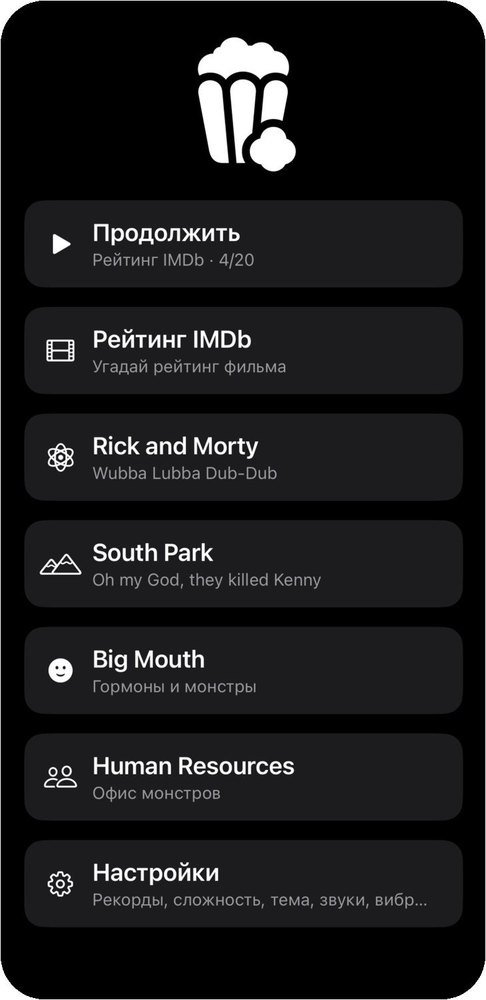
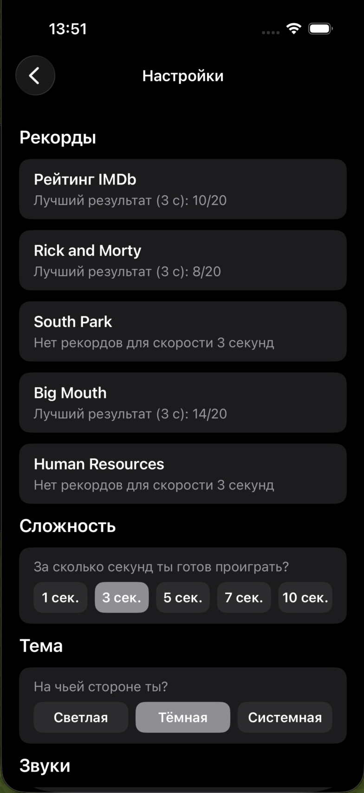
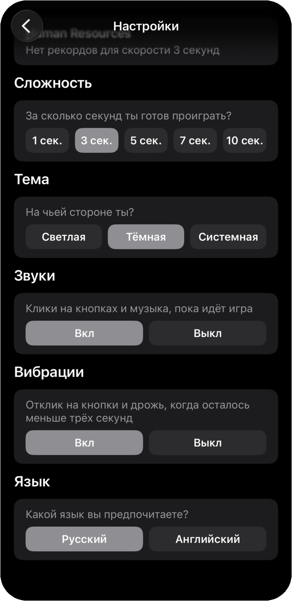
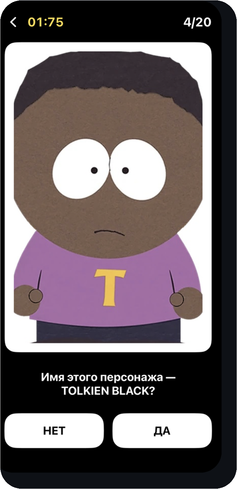
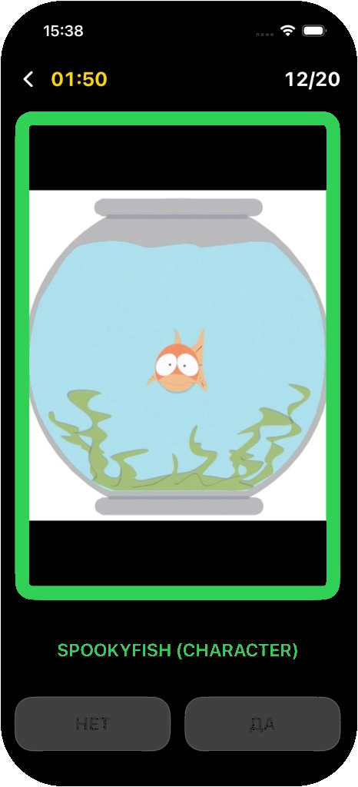
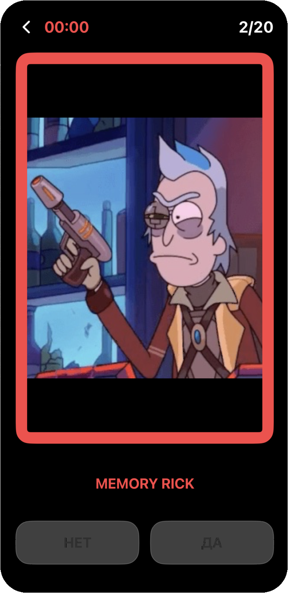
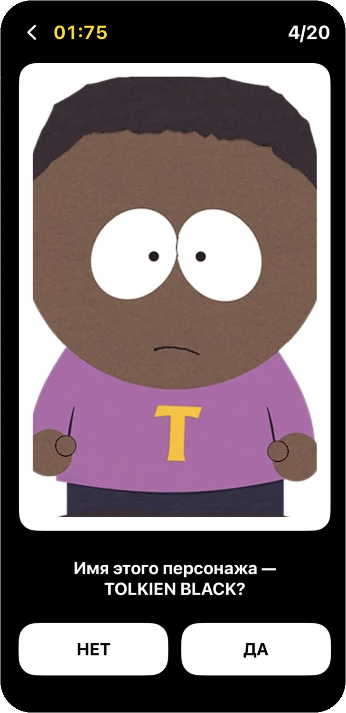
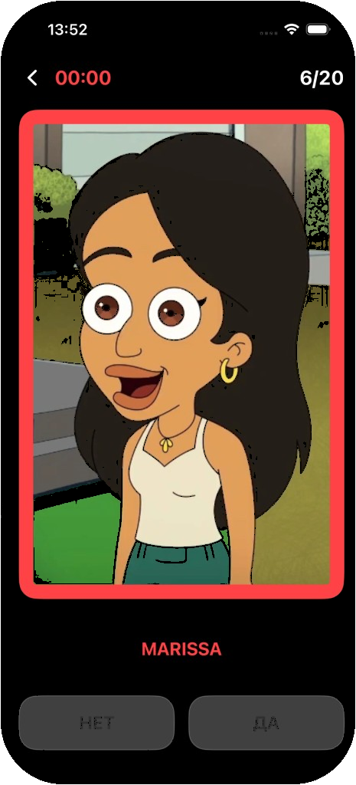
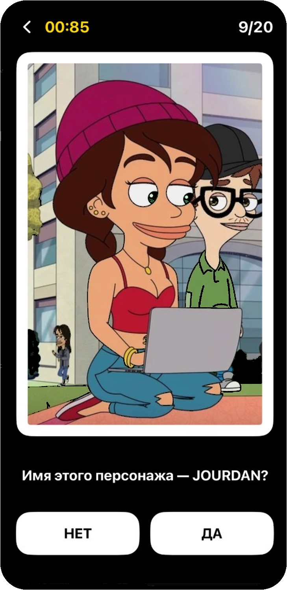
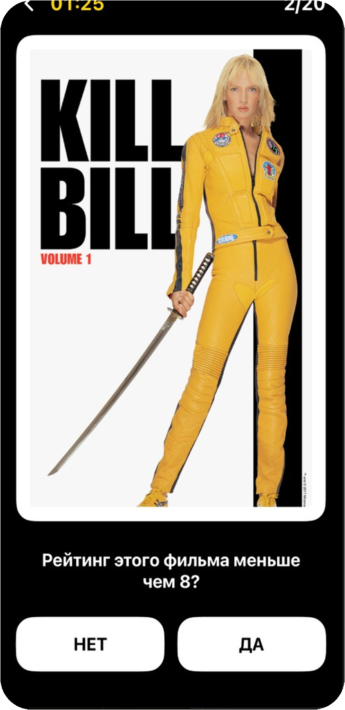

# Quizzler

iOS-викторина на SwiftUI: смотришь на картинку, жмёшь **Да** или **Нет**, пока тикает таймер.

Пять режимов. В **рейтинге IMDb** нужно угадать, выше или ниже порога оценка фильма. В Rick and Morty, South Park, Big Mouth и Human Resources — узнать персонажа. Раунд короткий, на 20 вопросов.

<p align="center">
  
  
  
</p>
<p align="center">
  
  
  
</p>
<p align="center">
  
  
  
</p>
<p align="center">
  
</p>

## Что внутри

На старте можно продолжить незаконченную игру или выбрать режим с нуля. Если в этом режиме уже есть сохранённый раунд, приложение спросит, вернуться к нему или начать заново.

После сплэша данные сериалов уже лежат в кэше, так что дальше можно играть без сети. У IMDb картинки другие: постеры уже лежат в проекте, в остальных режимах фото персонажей приходят по API.

В настройках — рекорды, скорость таймера (от неё зависит сложность: 1–10 секунд на вопрос), тема, звук, вибрация и язык (русский / английский). Вибрация ещё и дрожит на последних трёх секундах вопроса. Музыка крутится только пока открыт игровой экран.

## Режимы

- **Рейтинг IMDb** — около ста фильмов, на раунд случайно берутся 20. Постеры уже в проекте, в `Assets`, сеть для картинок не нужна. Вопрос строится вокруг настоящей оценки: «выше 8?» или «ниже 7?». Порог берётся из соседних целых к рейтингу. Сравнения с 10 не делаются: выше 10 на IMDb не бывает, а «меньше 10» почти всегда правда.
- **Rick and Morty** — персонажи и фото с [rickandmortyapi.com](https://rickandmortyapi.com)
- **South Park** — персонажи с [spapi.dev](https://spapi.dev), картинки качаются по API
- **Big Mouth** и **Human Resources** — персонажи с [Fandom](https://bigmouth.fandom.com) / [Wikipedia](https://en.wikipedia.org), фото тоже с API [Fandom](https://bigmouth.fandom.com/api.php) / [Wikipedia](https://www.mediawiki.org/wiki/API:Main_page)

## Без сети

Приложение рассчитано на то, что сеть пропадёт посреди дня.

На сплэше банки сериалов качаются заранее: списки персонажей и их картинки. Если запрос прошёл, JSON пишется на диск. Следующий запуск сначала смотрит в этот кэш. Сети нет — берётся последняя удачная копия. Картинки ещё и в памяти / `URLCache`, чтобы один и тот же постер не качать дважды.

Режим IMDb офлайн из коробки: и банк фильмов, и фото уже в проекте. В сериалах картинок в бандле нет — они приезжают по API и потом оседают в кэше.

Если сплэш не смог скачать банк и кэша ещё нет, можно нажать «Повторить» или зайти дальше: IMDb и уже сохранённые режимы всё равно откроются.

## Продолжить игру

Раунд не теряется, если закрыть экран или свернуть приложение.

На диск пишется снимок: режим, номер вопроса, счёт, сколько секунд осталось, текст, правильный ответ и текущая картинка. Для IMDb ещё и набор постеров этого раунда, чтобы после возврата не перемешать фильмы.

Карточка **Продолжить** на главном экране показывает режим и прогресс вроде `4/20`. Тап возвращает туда же: тот же вопрос, тот же таймер.

Если вместо «Продолжить» открыть тот же режим заново, приложение спросит: вернуться к сохранённому раунду или начать с нуля. Другой режим можно запустить сразу — сохранённая игра никуда не денется, пока её не затрут.

Снимок стирается, когда раунд доигран до конца. Новый старт в том же режиме тоже затирает старый файл.

## Как запустить

Нужны Xcode 16+ и iPhone / симулятор на iOS 18.

```bash
git clone https://github.com/dpogonia/Quizzler-SUI.git
cd Quizzler-SUI
open Quizzler.xcodeproj
```

Схема **Quizzler**, Run. Пакеты подключены через SPM.

Если правишь строки в `Quizzler/Resources`, удобно иметь [SwiftGen](https://github.com/SwiftGen/SwiftGen) — он обновит `L10n`. Без него сборка тоже проходит, в репозитории уже лежит сгенерированный файл.

Свою музыку на раунд можно положить в `Quizzler/Resources/Audio/` с именем `game_music` (лучше `.mp3`).

## Как устроен код

Собрано на Swift и SwiftUI, пакеты через Swift Package Manager. Сеть — `URLSession`, модели — `Codable`, диск — `FileManager`, настройки и рекорды — `UserDefaults`. Экраны обновляются через Combine. Звук на AVFoundation, вибрации на Core Haptics.

Контент сериалов приходит с [Wikipedia](https://en.wikipedia.org) / [Fandom](https://bigmouth.fandom.com) и публичных API: и имена, и фото. У IMDb наоборот — фильмы и постеры уже лежат в проекте, качать их не нужно.

В самом таргете в основном экраны и сборка зависимостей. Сеть, файлы и UserDefaults — в `Packages/CoreServices`. Логика квиза — в `QuizServices`. Кнопки и карточки — в `QuizUI`.

```text
Quizzler/
├── App/            сборка зависимостей
├── UI/             сплэш, меню, игра, настройки
├── Flux/           состояние раунда
├── Resources/      строки и звуки
└── Assets.xcassets постеры IMDb

Packages/
├── CoreServices
├── QuizServices
└── QuizUI
```

Скриншоты лежат в `Docs/`.
